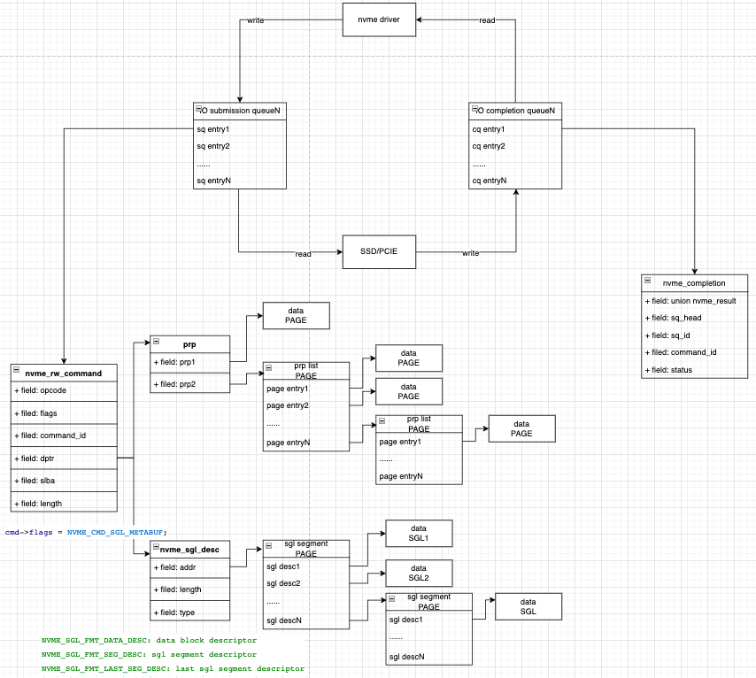

### NVMe

整个nvme协议从架构的角度上看，nvme这一层是在pci/pcie这个传输层之上的协议层。
本文只讨论nvme软件侧驱动需要做什么来使能nvme的硬件控制器，不深入讨论nvme的协议。

### nvme驱动按顺序主要完成一下事情
1. nvme设备是个pci/pcie设备，首先要获取到nvme设备的pci/pcie配置空间，获取到pci/pcie设备的bar值
1. 对nvme的bar空间进行控制器配置，配置相关的寄存器在nvme协议中可以找到对应的定义
1. 分配和初始化管理队列（admin queue），初始化中断
1. 通过管理队列发送管理命令，包括identify/features/等与器件的协商命令
1. 根据拿到的器件信息，创建对应block层的disk抽象和驱动层的namespace抽象
1. 分配和初始化io队列，通过管理队列，将io队列相关信息配置到硬件中，初始化中断
1. 处理io数据

### nvme io流程
