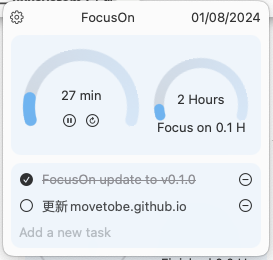

## FocusOn

*  [FocusOn](https://github.com/movetobe/FocusOn)

### 背景
我想要有自己的一个计时器，然后能够记录todo list的极简工具。
我对macos用的swiftUI一无所知，刚好chatGPT比较方便，就让TA帮我写了一个，当然过程就是把需求跟TA说，然后测试TA的代码。

当前就是这么个主界面，然后可以定时器倒计时，可以看每天专注了多长时间，可以添加任务。
后续会补充点根据日期添加任务，查看年/月/周的大任务等，以及UI优化，应该不会添加太多功能。